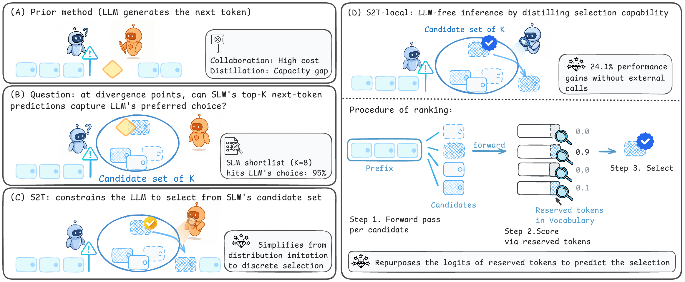
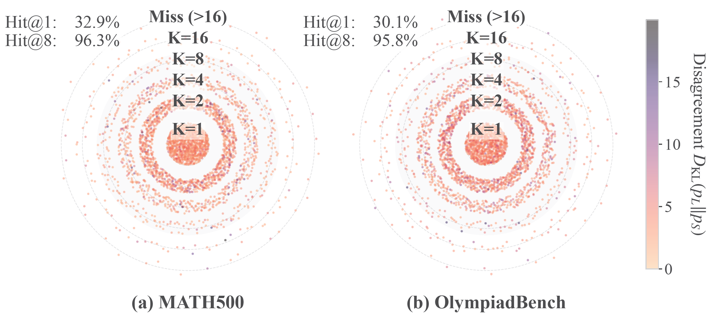
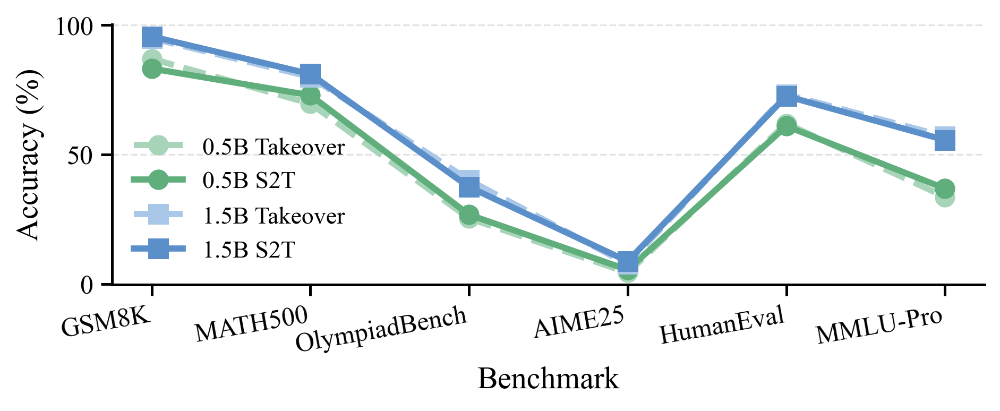
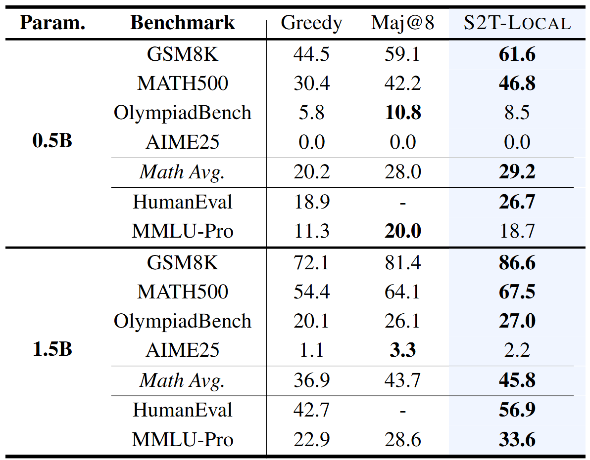

# Select to Think: Unlocking SLM Potential with Local Sufficiency

<p align="center">
  
</p>

<p align="center">
  <b>ICML 2026</b> &nbsp; | &nbsp;
  <a href="https://icml.cc/virtual/2026/poster/65879">Paper</a> &nbsp; 
</p>

---

## Overview

Small language models (SLMs) are efficient to deploy, but they often lag behind larger language models (LLMs) on complex reasoning tasks. Existing remedies typically follow one of two directions:

1. **Collaborative inference:** invoke an LLM at reasoning-divergence points, improving accuracy but introducing substantial latency and cost.
2. **Standard distillation:** train the SLM to mimic the LLM's full generative distribution, which is difficult under a large LLM-SLM capacity gap.

**Select to Think (S2T)** addresses this dilemma from a different angle. Instead of asking the LLM to generate the next token, S2T asks:

> At divergence points, does the SLM's own candidate set already contain the LLM's preferred token?

We find that the answer is often yes. At critical steps, the LLM-preferred token frequently lies inside the SLM's top-$K$ next-token candidates, even when it is not the SLM's greedy top-1 prediction. This phenomenon, which we call **local sufficiency**, enables a selection-based reasoning paradigm.

---

## Key Idea

S2T reframes LLM guidance from **generation** to **selection**.

Instead of letting the LLM freely generate the next token, S2T constrains the LLM to select from the SLM's local candidate set. This turns a high-dimensional distribution-matching problem into a bounded candidate-ranking problem.

We further introduce **S2T-Local**, which distills the selection logic into the SLM itself. S2T-Local uses reserved-token logits to score candidates, enabling LLM-free inference while preserving the SLM's original generation behavior.

---

## Method

At each decoding step, S2T follows three stages:

1. **Trigger:** identify divergence points where the SLM and LLM predictions differ substantially.
2. **Candidate construction:** collect the SLM's local top-$K$ candidate tokens.
3. **Selection:** select the best candidate using either:
   - the LLM selector in **S2T**, or
   - the distilled internal selector in **S2T-Local**.

For S2T-Local, each candidate is appended to the current prefix and passed through the SLM. The logits of reserved tokens are repurposed as candidate-quality scores. The candidate with the highest score is selected, and decoding continues locally.

---

## Main Results

We organize the results around three questions.

### 1. Does local sufficiency hold?

<p align="center">
  
</p>

At divergence points, greedy decoding captures the LLM's preferred token only about 30% of the time. However, expanding the candidate set to a compact top-$K$ shortlist dramatically increases coverage.

This suggests that many SLM reasoning failures are not caused by the absence of good local candidates, but by the inability to rank those candidates correctly.

---

### 2. Is selection enough to replace LLM generation?

<p align="center">
  
</p>

We compare S2T with a controlled **Takeover** baseline under the same trigger points. Takeover lets the LLM generate the next token directly, whereas S2T restricts the LLM to selecting from the SLM's candidates.

The comparable accuracy shows that bounded selection is often sufficient to recover the benefit of LLM intervention, without requiring open-ended LLM generation.

---

### 3. Can the selection logic be internalized into the SLM?

<p align="center">
  
</p>

S2T-Local distills the LLM's selection behavior into the SLM, enabling LLM-free inference.

S2T-Local consistently over greedy decoding (**>20.1%** relative gain), and approaches Maj@8 accuracy **with only a single decoding trajectory**.

---

## Repository Structure

```text
Select-to-Think/
├── assets
├── configs/
│   ├── qwen2.5_0.5b.yaml
│   └── llama3.2_1b.yaml
├── scripts/
│   ├── evaluate_s2t.py
│   └── train_s2t_local.py
│   ├── utils.py
└── README.md
```

<!-- ---

## Installation

```bash
git clone https://github.com/YeRona/Select-to-Think.git
cd Select-to-Think

conda create -n s2t python=3.10
conda activate s2t

pip install -r requirements.txt
```

---

## Quick Start

### Evaluate S2T

```bash
python scripts/evaluate_s2t.py \
  --student_model Qwen/Qwen2.5-1.5B-Instruct \
  --teacher_model Qwen/Qwen2.5-32B-Instruct \
  --dataset math500 \
  --candidate_size 8 \
  --trigger_rate 0.01
```

### Evaluate S2T-Local

```bash
python scripts/evaluate_s2t_local.py \
  --student_model Qwen/Qwen2.5-1.5B-Instruct \
  --selector_checkpoint checkpoints/s2t_local_qwen2.5_1.5b \
  --dataset math500 \
  --candidate_size 8
```

### Train S2T-Local

```bash
python scripts/train_s2t_local.py \
  --student_model Qwen/Qwen2.5-1.5B-Instruct \
  --teacher_model Qwen/Qwen2.5-32B-Instruct \
  --train_dataset math \
  --candidate_size 16 \
  --reserved_tokens 16 \
  --output_dir checkpoints/s2t_local_qwen2.5_1.5b
```

--- -->

## Citation

```bibtex
@inproceedings{ye2026selecttothink,
  title     = {Select to Think: Unlocking SLM Potential with Local Sufficiency},
  author    = {Ye, Wenxuan and Zhang, Yangyang and An, Xueli and Carle, Georg and Ma, Yunpu},
  booktitle = {Proceedings of the 43rd International Conference on Machine Learning},
  year      = {2026}
}
```
